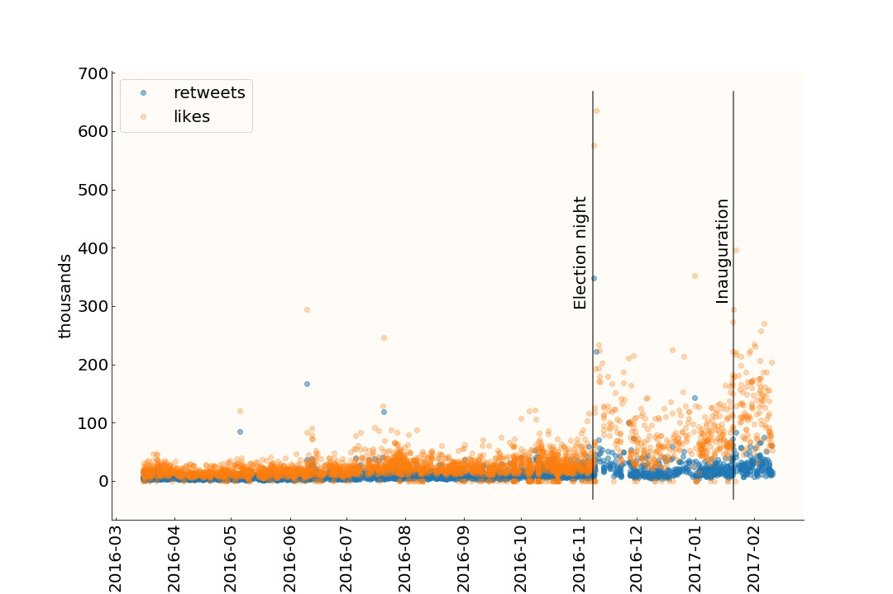
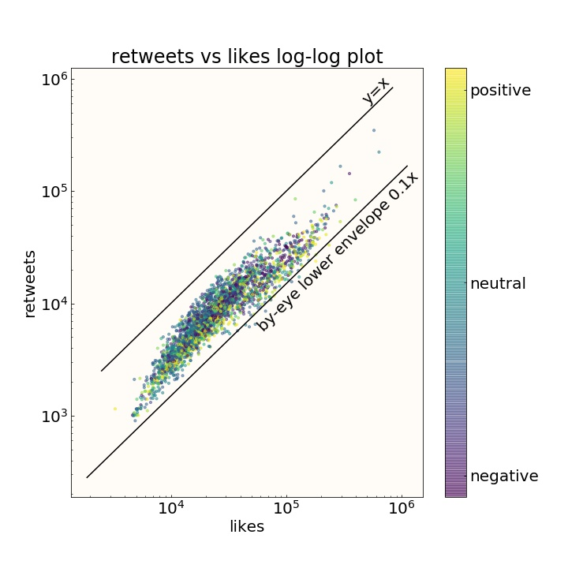

# trumpTweets

Trump tweets...
Every morning I check twitter, first thing, while still in bed, to see if a presidential executive order removed one of the freedoms American citizens have till today enjoyed. The fact that this would come through twitter is quite depressing. The value of eloquence is dead, clearly. But tweets are by their 140 character nature suited to be analyzed, so I figured I'd look form something interesting, some pattern, some reason and order in this madness. I found nothing. From a data science point of view the pile of words uttered through twitter by DT is boring as hell. Honestly people. We just need to not to pay attention to it. Really, the important, the terrifying things will happen in a deafening twitter silence and the stage we are offering to his bitching and moaning, cause largely this is what it is, continues to make him feel important. He is not. He is just the right man in the right place and time, or better, the very very wrong man at the worse possible place and time.

So as I set off to find patterns in Trump's tweets I found that they are really boring and average, from a data science perspective. Nonetheless, here are some of the week patterns I found. 

## Likes and Retweets: DT's approval on twitter

Here are 3200 or so tweets by DT, and I am plotting the number of likes and number of retweets. Some patterns were immediately obvious: increase popularity after election night, and again after inauguration, and decreased tweet rate after the election (remember when his campaign manager sequestered his twitter account?).

The number of retweets per tweet is about 1/3 of the number of likes. I tried to disentangle the effect of dissent retweets, from the approval retweets, and there is some evidence that dissent retweets contribute to the tally:

