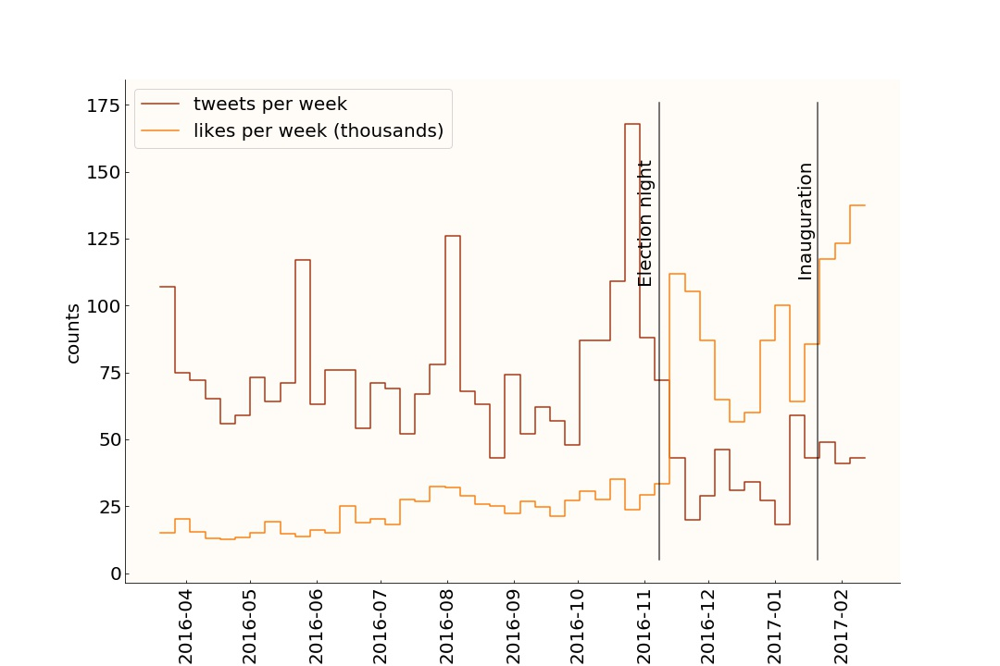
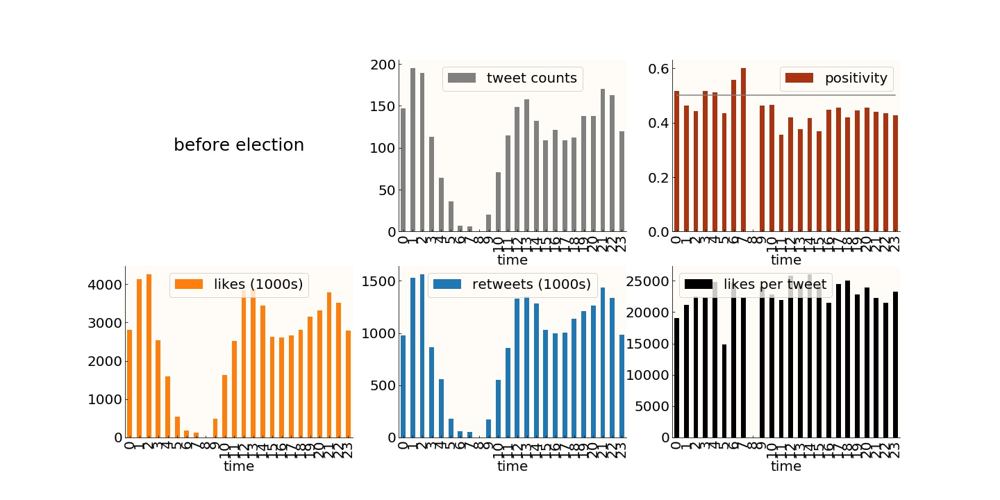

# trumpTweets

Trump tweets...
Every morning I check twitter, first thing, while still in bed, to see if a presidential executive order removed one of the freedoms American citizens have till today enjoyed. The fact that this would come through twitter is quite depressing. The value of eloquence is dead, clearly. But tweets are by their 140 character nature suited to be analyzed, so I figured I'd look form something interesting, some pattern, some reason and order in this madness. I found nothing. From a data science point of view the pile of words uttered through twitter by DT is boring as hell. Honestly people. We just need to not to pay attention to it. Really, the important, the terrifying things will happen in a deafening twitter silence and the stage we are offering to his bitching and moaning, cause largely this is what it is, continues to make him feel important. He is not. He is just the right man in the right place and time, or better, the very very wrong man at the worse possible place and time.

So as I set off to find patterns in Trump's tweets I found that they are really boring and average, from a data science perspective. Nonetheless, the entire work is in the notebook <a href=""> tweetsAnalysis.ipynb</a>, and here are some of the week patterns I found. I will continue to watch his tweets, hoping to see his popularity decrease.

## Likes and Retweets: DT's approval on twitter

Here are 3200 or so tweets by DT, and I am plotting the number of likes and number of retweets. Some patterns were immediately obvious: increase popularity after election night, and again after inauguration, and decreased tweet rate after the election (remember when his campaign manager sequestered his twitter account?).

The number of retweets per tweet is about 1/3 of the number of likes. I tried to disentangle the effect of dissent retweets, from the approval retweets, and there is some evidence that dissent retweets contribute to the tally:

Also consider his least retweeted tweet (which still has nearly 1000 retweets).

    "@jrector34: @realDonaldTrump Amazing job"
    
It is DT citing a random tweet in his support from an account without picture, started on April 2015, which has 82 followers and some 750 tweets, ALL OF THEM, as far as I can say, in support of DT. So clearly an account generated to support DT  which gets retweeted by DT to show how the people support DT, and then retweeted by 901 people. tThis is likely a fake account created to boost his approval and visibility. It's fully expected that those would exist, and this account has no other explanation. But the fact that he retweets it is very meta, and very depressing.

## Sentiment analysis
The color segregation in the plot on the left may be the indication of the effect of dissent retweets: the tweets are colored by the probability of being positive: yellow is likely positice, purple likely negative. Yellow tweets sit at the bottom/right of the distribution: positive tweets are retweeted less, given the same number of likes, than negative tweets.e

Sentiment analysis of DTs tweets is actually tricky: there is a lot of sarcarsm and passive-aggressive staements. As a result most of his tweets are just belof 50% probability of being positive (i.e. are slightly negative).
As a result, ironic features, like his "Happy new year", which is his fourth most liked with 352747 likes, and retweeted tweet, with 143156 retweets, is classified as certainly negative (probability of being positive \<5% positive) due to the presence of words like enemies, lost, etc... and in spite of the "Love" ending:

    Happy New Year to all, including to my many enemies and those who have fought me and lost so badly they just don't know what to do. Love! 

Also, the top two sentiment predicing words in his tweets are "bam" and "sad", and runner ups include "ugh", "shame" (all very presidential), and ... "justinbieber". Make of it what you wish.

## Trends in time
                     
  

Here is a depressing trend: the likes DT gets on his tweets increase significantly in correspondence of election night and inauguration, and steadily increased since election night. Not only that, but his tweet rate decreased significanty. So the likes-per-tweet skyrocketed after election night.		

    
His sentiment changed to after the election: he tweeted less and his tweets were more polarized (probability of being positive was closer to 0 or 1)

Here is what I am gonna do: I am gonna keep following his tweets. When I see a decrease in his twitter appreciation, I'll let you know. 

    

## Daily trands

          

DT seems to tweet at all hours of the day, except for 8AM. Never a tweet in the 8th hour... lots and lots of tweets till 3AM, although his most popular tweets are in the morning. The late night tweets were curbed after the election. Other than that, no patterns significantly changed.

